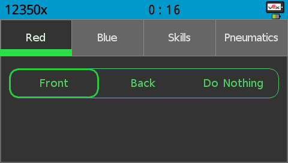
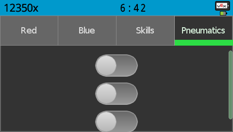

# Vex Autonomous Selector for PROS


New pneumatics menu (Added by Adam Salem from 12350X)



This is the Developer branch and as a result an entire PROS Project is included for development

## How to use:


  `if(selector::auton == 1){ //run auton for Front Red }`

1. Create multiple if statements for all possible numbers of selector::auton.
2. All default cases are listed below:

* selector::auton == 1 : Red Front
* selector::auton == 2 : Red Back
* selector::auton == 3 : Do Nothing
* selector::auton == -1 : Blue Front
* selector::auton == -2 : Blue Back
* selector::auton == -3 : Do Nothing
* selector::auton == 0 : Skills

## How to customize the selector
All configuration is done from the `autoSelect/selection.h` file.
```
// selector configuration
#define HUE 360 // color of theme from 0-360
#define AUTONS "Do Nothing", "Front", "Back" // names of the autonomous programs
#define DEFAULT 1 // default auton
```
* `HUE` - Controls the color of the theme.
* `AUTONS` - A list of every autonomous option. This list can be made any length, but may format weirdly.
* `DEFAULT` - The auton will be selected on startup. This is required for starting a programming skills run from the controller.

Credit also to Sully|80508X
